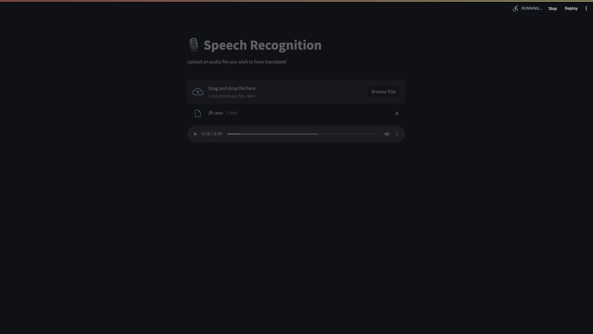

I tried getting the translation, but ran into a lot of issue son the way there. For one, at the step to build the image with (podman build -t whisper:image .) my podman machine was nto starting. Everytime I would try to start podman, it would throw a 125 error. I even deleted podman and reinstalled it but it still gave the issue. Ultimately, I stopped altering the CPU and memory sliders and that helped. 

Once I got podman up, was able to use the dependencies to build and program the image. Then when it came time for streamlit to run the LLM, i got a connection and authorization error. I went on stackoverflow and github pages to work on those but I ultimately got stuck on a JasonErrorCode error where it seemed like a json file was nto being read(??) 

The last time I ran the program, the error didn't appear, but the code ran for so long and a translation wans't produced. Either way, I learned a lot about troubleshooting errors, how to access ports, and quicker ways to download dependencies (brew install vs pip3 install)

